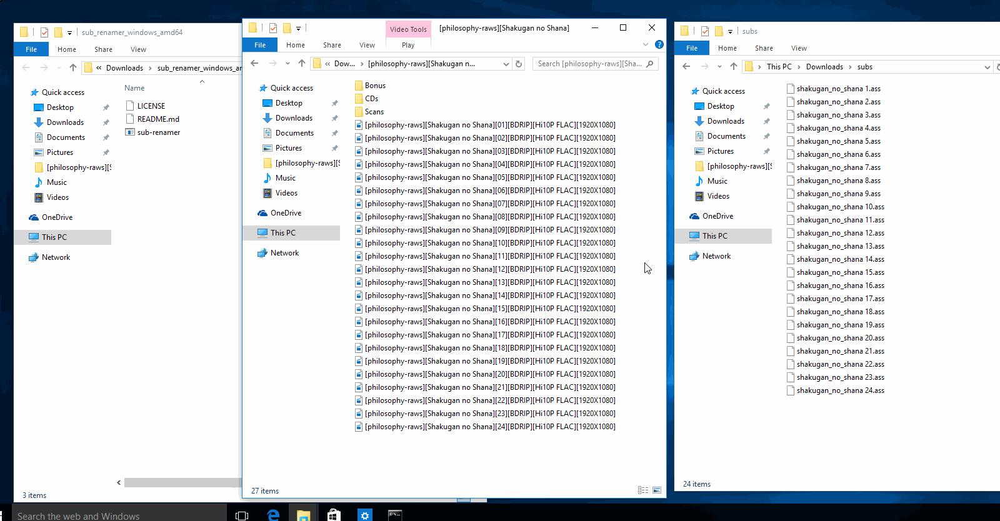

# Sub-Renamer

English | [简体中文](./)

自动为字幕文件匹配视频并重命名的 CLI 工具。

如果这个程序对你有所帮助，可以帮忙给一个 star，谢谢 OwO。

<!-- 
  If you prefer to use your own Moe-Counter
  please refer to the tutorial 
  in its original repo: https://github.com/journey-ad/Moe-Counter
  and deploy it to the Replit or Glitch
-->


## 安装

### 使用 `go`

```sh
$ go install -ldflags "-w -s" github.com/acgtools/sub-renamer@latest
```

### 从 Release 页面下载

[Release page](https://github.com/acgtools/sub-renamer/releases)

## 快速开始

```sh
$ sub-reanmer -h
sub-renamer <video dir> <sub dir>

Usage:
  sub-renamer [flags]

Flags:
  -c, --copy               copy subtitles after renaming
  -h, --help               help for sub-renamer
      --log-level string   log level, options: debug, info, warn, error (default "info")
  -v, --version            version for sub-renamer

```

### 如何在 Windows 上使用

1. 下载 zip 包，并解压到你想要的文件夹中

2. 打开 `cmd`程序：你可以在 Windows 栏中搜索 “cmd”，然后点击 “命令提示符”

3. 复制你刚才解压的文件夹路径，然后输入以下命令并按下`回车键`：

   ```cmd
   cd /d "<你复制的路径>"
   ```

4. 复制视频文件夹和字幕文件夹路径，然后输入以下命令并按下`回车键`：

   > **注意：请保证视频文件夹路径是第一个参数**
   >
   > 因为程序会对第二个参数中的文件进行重命名，且操作是不可逆的。并且视频文件比较大，备份起来很麻烦。

   ```cmd
   # 重命名字幕文件
   .\sub-renamer.exe "<视频文件夹路径>" "<字幕文件夹路径>"
   
   # 使用 -c 在重命名之后，复制字幕到视频文件夹
   .\sub-renamer.exe -c "<视频文件夹路径>" "<字幕文件夹路径>"
   ```



## Issue

欢迎创建 issue 来报告 bug 或者 请求添加新特性。

